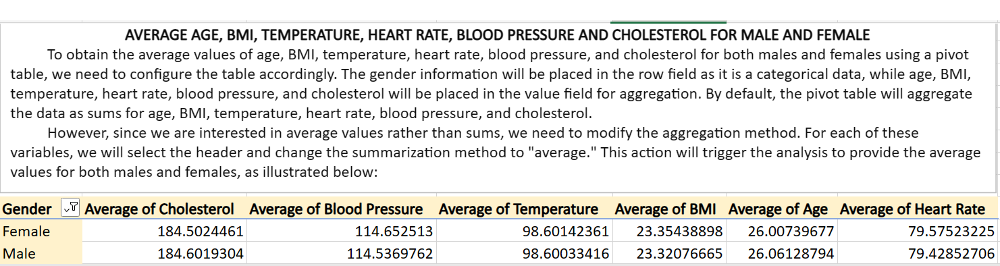
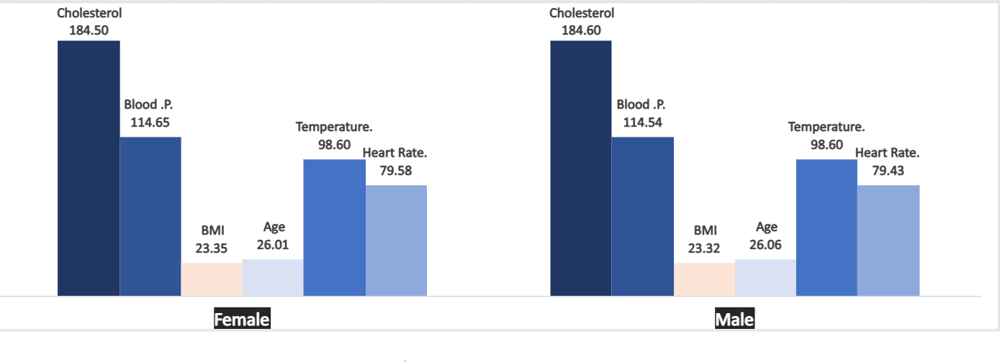
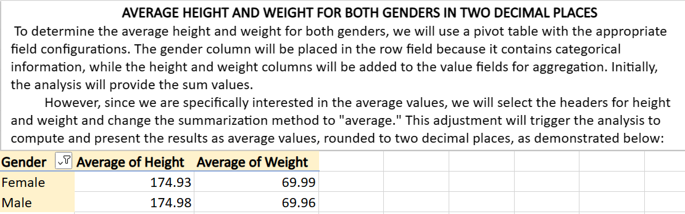
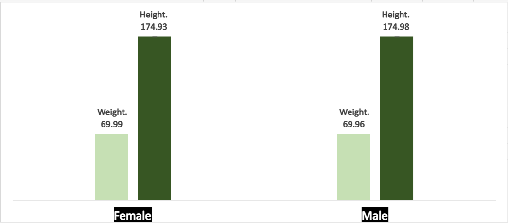
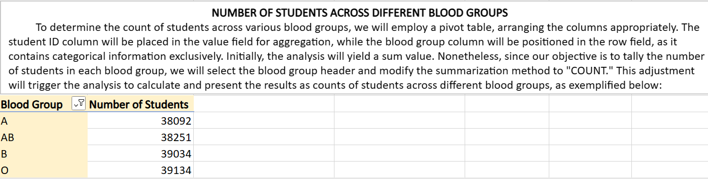
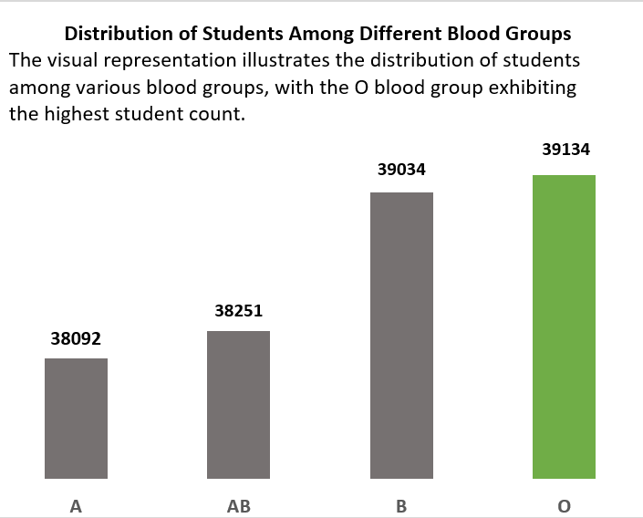
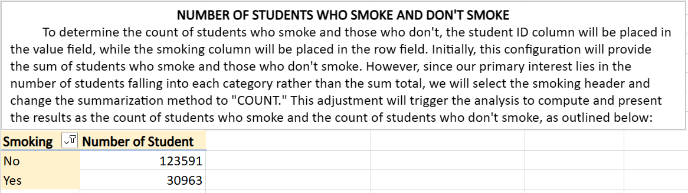
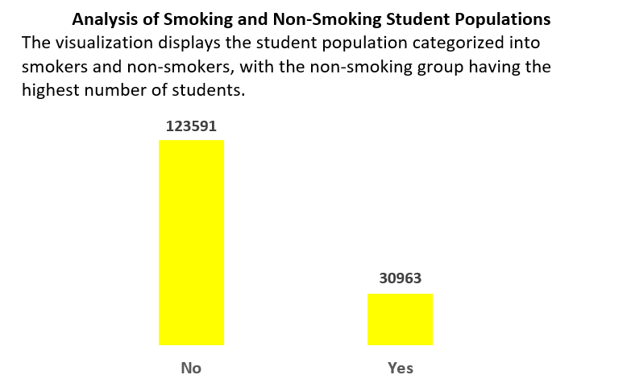
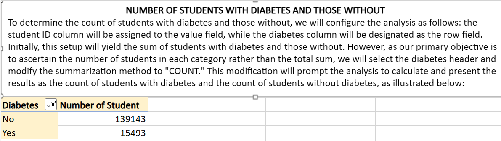
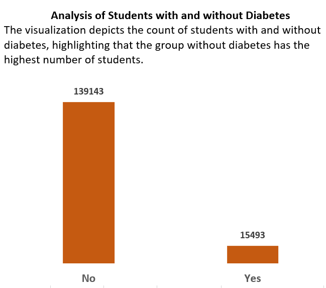

# STUDENTS MEDICAL ANALYSIS

## INTRODUCTION

This Excel task involves analyzing the health data of students, utilizing a substantial dataset comprising 192,356 rows and 13 columns of information. The objective is to uncover valuable insights by creating Pivot Tables that emphasize key indicators such as age, BMI, temperature, heart rate, blood pressure, cholesterol, height, weight, blood groups, smoking habits, and diabetes status. Through these tables, we aim to calculate average values, identify gender-based health patterns, and explore the distribution of various health-related attributes. Join us in exploring and interpreting the data to gain a deeper understanding of the diverse health characteristics within the student population.

## PROBLEM STATEMENT

The task involves leveraging the 'Students Medical Dataset' to derive valuable insights through the creation of Pivot Tables. Specifically, we aim to address the following analytical objectives:

1. Average cholesterol, blood pressure, BMI, age, temperature and heart rate, segregated by gender (Male and Female)
2. Average height and weight for both Male and Female students, rounded to two decimal places
3. The number of students across different blood groups
4. The number of students who smoke and those who do not smoke
5. The number of students with diabetes and those without diabetes
6. Create visual representations, such as charts or graphs, for each objective to effectively communicate the insights derived from the Pivot Tables.

These visualization will enhance the interpretability of the data and facilitate a deeper understanding of health patterns among the students.

## SKILLS AND CONCEPTS DEMOSTRATED
- Pivot table proficiency
- Data aggregation
- Data Visualization
- Data interpretation

## ANALYSIS, RESULTS AND DISCUSSION

### 1. Average Cholesterol, Blood pressure, BMI, Age, Temperature and Heart Rate, Segregated by Gender (Male and Female)

To compute the average cholesterol, blood pressure, BMI, age, temperature and heart Rate for both genders, the following steps are involved: Start by creating a pivot table. Select all the data, navigate to the "Insert" tab on the Excel ribbon, click on "Pivot Table," and choose the table range, often auto-selected. Next, select the pivot table destination, either a new worksheet or an existing one, and click "OK." Once the pivot table is created, a field list will appear alongside it, containing four different fields.

Now, drag the columns for age, BMI, temperature, heart rate, blood pressure, and cholesterol into the "Values" field for aggregation. Simultaneously, place the gender column into the "Row" field for categorization. By default, the pivot table aggregates values as a sum. However, since we seek average values, modify this by selecting each header, right-clicking, and opting to summarize values by average. This action will run the analysis, providing the average values for each specified column, categorized by gender.

PIVOT TABLE                                                                   |VISUALIZATION
:----------------------------------------------------------------------------:|:----------------------------------------------------------------------------------:
                                                       |

### 2. Average Height and Weight for Both Male and Female Students, Rounded to Two Decimal Places

To calculate the average height and weight for both males and females, drag the height and weight columns into the "Values" fields as they are the aggregate columns. Simultaneously, place the gender column into the "Row" field as it serves as the categorical column. By default, the pivot table aggregates values by sum. To modify this to average aggregation, click on the column headers and choose to summarize values by average.
This action will reaggregate the data and yield results for the average height and weight for both males and females, rounded to two decimal places.

PIVOT TABLE                                                                    |VISUALIZATION
:-----------------------------------------------------------------------------:|:----------------------------------------------------------------------------------:
                                                                |

### 3. The Number of Students Across Different Blood Groups

To ascertain the count of students across various blood groups, place the students column into the "Values" fields and the blood group into the "Row" field. Adjust the default aggregate value to "count." This will generate the number of students across different blood groups as follows:

- Blood Group A = 38,092
- Blood Group AB = 38,251
- Blood Group B = 39,034
- Blood Group O = 39,134

PIVOT TABLE                                                                    |VISUALIZATION
:-----------------------------------------------------------------------------:|:----------------------------------------------------------------------------------:
                                                                |

### 4. The Number of Students Who Smoke and Those Who Do Not Smoke

To determine the count of students who smoke and those who do not smoke, place the students column into the Pivot "Values" field and the smoking column into the "Row" field. Adjust the default aggregation to the count function. The result for the number of students who smoke and those who do not smoke would be as follows:

- Non-Smokers (NO) = 123,591
- Smokers (YES) = 30,963

PIVOT TABLE                                                                    |VISUALIZATION
:-----------------------------------------------------------------------------:|:----------------------------------------------------------------------------------:
                                                                |

### 5. The Number of Students With Diabetes and Those Without Diabetes

To ascertain the count of students with diabetes and those without diabetes, place the students column into the "Values" field for aggregation and the diabetes column into the "Row" field for categorization. Adjust the default aggregation column to the count function. The results for the number of students with diabetes and those without diabetes would be as follows:

- Without Diabetes (NO) = 139,143
- With Diabetes (YES) = 15,493

PIVOT TABLE                                                                    |VISUALIZATION
:-----------------------------------------------------------------------------:|:----------------------------------------------------------------------------------:
                                                                |

## RECOMMENDATION

- Implement health education programs focusing on lifestyle factors such as smoking habits and BMI, aiming to raise awareness and promote healthier choices among students.
- Particularly for students with diabetes, individualized health plans could contribute to better management and support for those with specific health conditions.
- Launch awareness campaigns regarding blood groups, emphasizing the importance of knowing one's blood type for emergency situations. This can contribute to a better-prepared student community.
- Encourage and facilitate regular health check-ups for students, considering the prevalence of specific health indicators. Early detection and intervention can significantly impact long-term health outcomes.
- Integrate the findings into broader student well-being initiatives, fostering a holistic approach to health that encompasses physical, mental, and lifestyle aspects.

## CONCLUSION

In conclusion, the analysis of the medical student dataset has provided valuable insights into the health characteristics of the student population. The average values for key health metrics, blood group distribution, smoking habits, and diabetes prevalence have been elucidated through the creation of Pivot Tables. These insights serve as a foundation for informed decision-making and targeted interventions to enhance student well-being.

Understanding the prevalence of specific health indicators among students allows for the development of proactive measures to address potential health risks and promote healthier lifestyles. By leveraging these findings, educational institutions can take steps to create a health-conscious environment that supports the diverse needs of the student community. This project exemplifies the power of data-driven decision-making in fostering a healthier and more informed student population.

